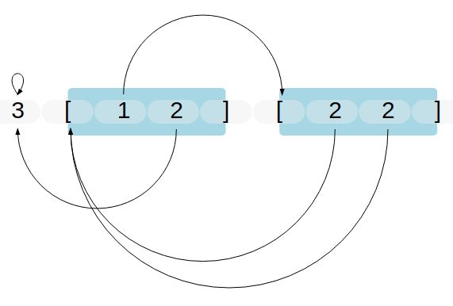

# Siteswap Notation Rendering Engine 

Experimental package for visualizing
[siteswaps](https://en.wikipedia.org/wiki/Siteswap).  Siteswaps are a notation
system used in juggling to represent patterns in space.  It accepts input in the
form of numbers `0-9` and brackets `[`,`]` (which denote multiplexes, i.e.
synchronous events). The engine prints the input expression and draws arrows
from each valid throwable position its related catch position. Multiplexes throw
from their contents, but recieve at their opening bracket.

# Example


# Documentation
See the documentation on
[package.elm-lang.org](http://package.elm-lang.org/packages/ambuc/juggling-graph/latest).

Right now `index.html` exists so that a demo can live at
[jbuckland.com/juggling-graph](http://jbuckland.com/juggling-graph/). 

# Build
Run `./build.sh` to run the `elm-make` command which generates `main.js`.

## `renderExpr`

```elm
{-| Generates an svg of the given siteswap.

    renderExpr <canvas width> <expression>
    renderExpr 500 "3[12][22]"

-}
```

# TODO
 - [x] Higher-throw counts, i.e. `[a-w]` for throws greater than nine beats long.
 - [x] Synch siteswap notation, i.e. `(_,_)` for per-hand notation.
 - [ ] Arrows stop short of their destination if another arrow is emerging from
   that side (conflict resolution).
 - [ ] Multiple arrows for more traveled orbits.
 - [ ] Colors per-orbit.

